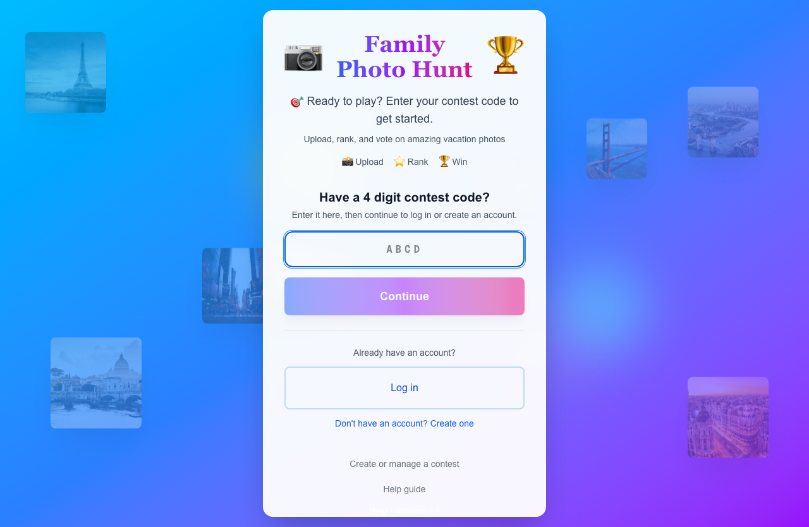
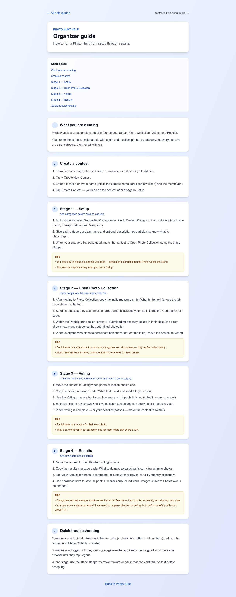
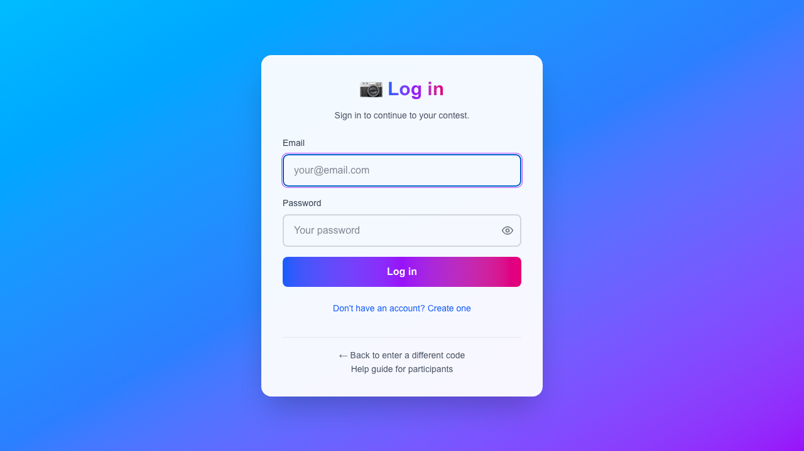
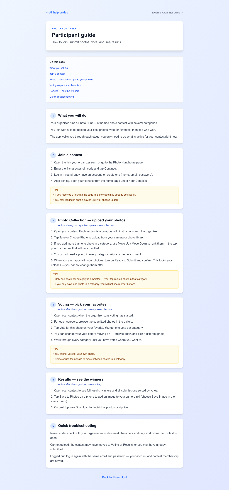
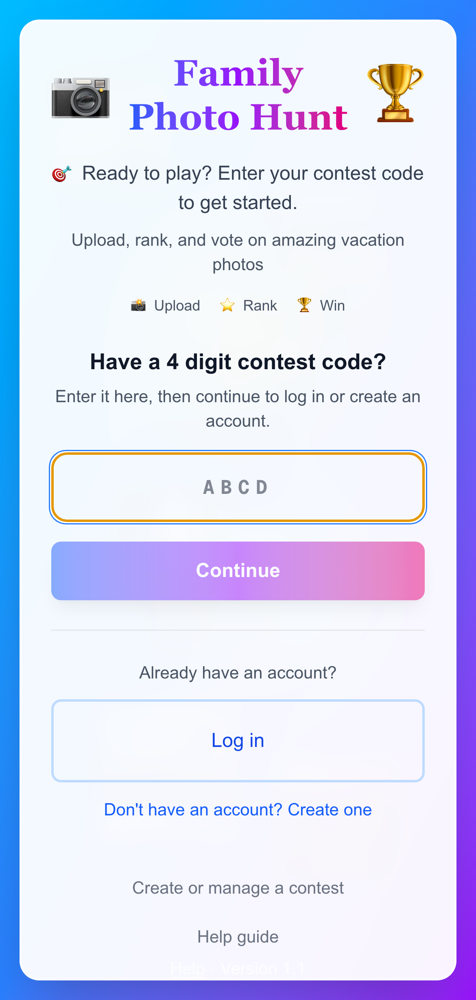

# Photo Hunt — Group Photo Contest Platform

**Turn any trip, reunion, or team event into a friendly photo competition.**

Live site: [https://www.familyphotohunt.com](https://www.familyphotohunt.com)

---

## What is Photo Hunt?

Photo Hunt is a web app for running themed photo contests with friends, family, or colleagues. An organizer creates a contest, picks categories (Food, Best View, Silly Moment, etc.), shares a short join code, and the group uploads photos, votes on favorites, and celebrates winners together.

No app store download required — it works in the phone browser and on desktop.



---

## Who is it for?

| Audience | What they get |
|----------|----------------|
| **Organizers** (trip planner, host, team lead) | Create contests, define categories, control stages, track progress, run a winner reveal |
| **Participants** (family, friends, coworkers) | Join with a code, upload photos from their camera roll, vote once per category, view results |

Perfect for: family vacations, reunions, company retreats, school trips, neighborhood events, and any gathering where people are already taking photos.

---

## How a contest works — four stages

Every contest moves through four clear stages. The organizer controls when to advance; participants always see what they need to do for the current stage.

| Stage | Name | What happens |
|-------|------|----------------|
| **1** | **Setup** | Organizer adds categories. Join code is hidden until collection opens. |
| **2** | **Open Photo Collection** | Join code goes live. Participants upload and submit one photo per category. |
| **3** | **Voting** | Uploads close. Everyone votes for one favorite photo per category (not their own). |
| **4** | **Results** | Winners announced. Full scoreboard, slideshow reveal, and photo downloads. |

---

## Stage 1 — Setup (organizer)

- Create a contest with a **location or event name** and **month/year** (e.g. “Paris 2026” or “Company Retreat”).
- Add categories from **suggested themes** or create custom ones with descriptions.
- Move to **Open Photo Collection** when the category list is ready.



---

## Stage 2 — Open Photo Collection

**Organizer**

- A **4-character join code** appears (e.g. `A3K9`).
- Copy a ready-made **invite message** (includes link + code) and send it by text or email.
- Watch the **Participants** panel: see who has submitted and how many categories each person completed.

**Participants**

- Enter the join code on the home page (or follow a link with the code pre-filled).
- Create an account or log in — the app keeps you signed in on the same device.
- Open the contest and upload photos **per category** from camera or photo library.
- Rank multiple photos in a category (top photo is submitted).
- Toggle **Ready to Submit** to lock in picks — one photo per category goes to voting.



---

## Stage 3 — Voting

**Organizer**

- Move the contest to **Voting** when collection time is up.
- Send the **voting announcement** snippet to the group.
- Track **voting progress** — see how many participants finished all categories.

**Participants**

- Browse submitted photos in a **gallery per category**.
- Pick **one favorite per category** (cannot vote for your own photo).
- Change your vote anytime before the organizer closes voting.

**Rules**

- One vote per person per category.
- Ties for most votes can share a win.

---

## Stage 4 — Results

**Organizer**

- Move to **Results** when voting is complete.
- **View Results** — full scoreboard with vote counts.
- **Start Winner Reveal** — TV-friendly fullscreen slideshow, category by category.
- Download **all photos** or **winners only** as ZIP files.

**Participants**

- See winners and all submissions sorted by votes.
- **Save to Photos** on iPhone/Android from the results screen.

---

## Participant experience at a glance



1. **Join** with code → log in or register  
2. **Upload** photos by category during collection  
3. **Submit** when ready (locks uploads)  
4. **Vote** for favorites when voting opens  
5. **Celebrate** when results are published  

Built-in help: [/help/participants](https://www.familyphotohunt.com/help/participants)

---

## Organizer experience at a glance

- **Admin dashboard** — all contests you run, with current stage shown on each card  
- **Stage stepper** — visual 4-step control to move forward or back (with confirmation)  
- **Copyable announcements** — pre-written messages for collection, voting, and results  
- **Participant tracking** — submission status during collection; vote progress during voting  
- **Category library** — dozens of suggested themes (Animal, Architecture, Food, Transportation, etc.)

Built-in help: [/help/admin](https://www.familyphotohunt.com/help/admin)

---

## Mobile-first design

Photo Hunt is built for phones — upload from the camera roll, vote in a swipe-friendly gallery, save winners to your camera roll. Desktop works great for organizers managing the contest and for the **Winner Reveal** on a TV or projector.



---

## Key features summary

| Feature | Detail |
|---------|--------|
| Join codes | 4 characters — easy to text to a group |
| Categories | Unlimited custom themes; optional descriptions |
| Photo ranking | Participants pick their best shot when they upload several |
| Single submission | One submitted photo per person per category |
| Fair voting | One vote per category; no self-voting |
| Progress tracking | Organizer sees who submitted and who finished voting |
| Winner reveal | Presentation mode for in-room celebrations |
| Downloads | ZIP of all photos or winners only |
| Persistent login | Stay signed in on the same browser |
| Help guides | In-app guides for organizers and participants |

---

## Getting started

1. Go to **[www.familyphotohunt.com](https://www.familyphotohunt.com)**  
2. Tap **Create or manage a contest** (or visit `/admin` after signing in)  
3. Create your first contest, add categories, and invite your group  

Participants only need the home page and a join code — no admin access required.

---

## Screenshots included in this folder

| File | Description |
|------|-------------|
| `screenshots/01-home-*.png` | Landing page — join code entry |
| `screenshots/02-login-*.png` | Sign in / create account |
| `screenshots/03-help-home-*.png` | Help hub |
| `screenshots/04-help-admin-*.png` | Organizer guide |
| `screenshots/05-help-participants-*.png` | Participant guide |

`*-desktop.png` = browser view · `*-mobile.png` = phone view

Regenerate screenshots: `node scripts/capture-marketing-screenshots.mjs`

---

## Slide deck

An editable PowerPoint overview is included: **`Photo-Hunt-Overview.pptx`**

Rebuild the deck after updating screenshots:

```bash
.venv-marketing/bin/python scripts/build-photo-hunt-deck.py
```

---

*Photo Hunt — familyphotohunt.com*
